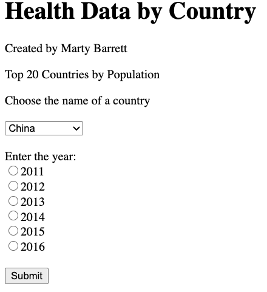
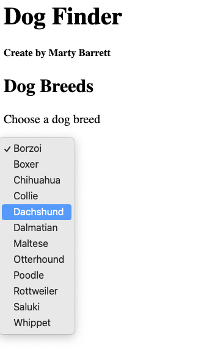
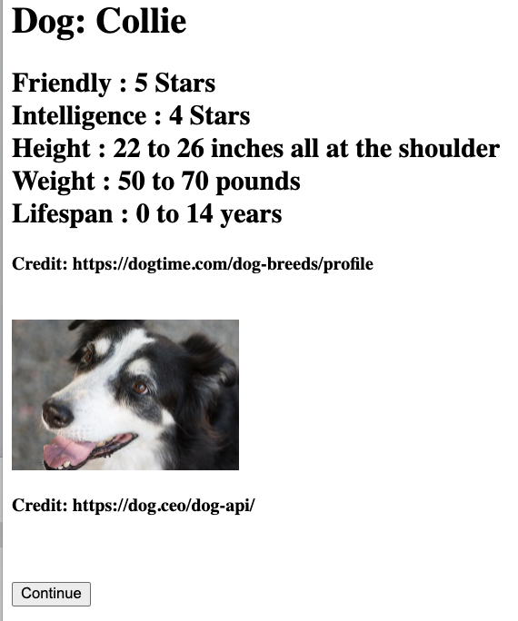
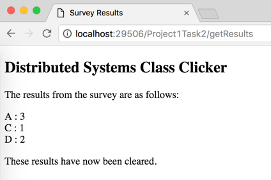
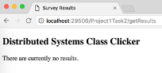
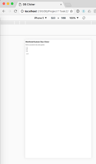
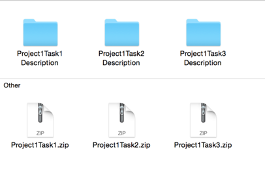
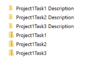
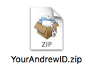

# 95-702 Distributed Systems
# Project 1
## Assigned: Friday, February 5, 2021
## Due: Friday, February 19, 2021, 11:59 PM

This project has five objectives:

**First**, you are introduced to IntelliJ and TomEE. You already have some practice
with these. In this assignment, you'll build several web apps to gain more
experience.

**Second**, you build your first set of distributed systems. These are two small
web applications using Servlets and Java Server Pages.

**Third**, you are introduced to simple JSON processing and web scraping.

**Fourth**, you are introduced to the MVC pattern if you have not used it before.

And **fifth**, as in all projects this semester, you should reflect on the
functional and non-functional characteristics (e.g. security, scalability,
failure handling, interoperability) of your solutions. There will be questions
on the final exam concerning these characteristics. You should be
able to demonstrate a nuanced comprehension of course content and be able to
explain the technical aspects in relation to potential real-world applications.
For each project task, software documentation is required. The software that you
write (Java files and so on) must contain comments that describe what each
significant piece of code is intended to accomplish. Points will be deducted if
code is not well documented. Read the documentation-related links provided on
the course schedule (for class #1) to understand what is expected.
Be sure to consult the rubric for details on grading.

# Task 1
# Use the IntelliJ Project Name:  Project1Task1

Create an index.jsp page that asks the user to enter a string of text data, and
to make a choice of two hash functions using radio buttons. The hash function
choices should be MD5 and SHA-256, with MD5 being the default.  When the submit
button is pressed a request is sent to a servlet. The servlet must be named
ComputeHashes.java. The servlet will compute the requested cryptographic hash
value (MD5 or SHA-256) from the text transmitted by the browser. You will need
to employ the Java crypto API to compute the hash of the text. The original text
will be echoed back to the browser along with the name of the hash, and the hash
value. The hash values sent back to the browser should be displayed in two
forms: as hexadecimal text and as base 64 notation. We will discuss the use of
such hash values later in the course.  To compute the MD5 and SHA-256 hashes,
use these standard java packages:

    import java.security.MessageDigest;
    import java.security.NoSuchAlgorithmException;

To print the Base64 encoding, use the following method:

    javax.xml.bind.DatatypeConverter.printBase64Binary

To print the hexadecimal encoding, use the following method:

    javax.xml.bind.DatatypeConverter.printHexBinary

Be sure to provide a simple and user friendly interface.  If you are unfamiliar
with HTML forms, a simple explanation can be found at:

    http://www.w3schools.com/html/html_forms.asp .

Be sure to create screen shots of your working application and submit them as
described in the Submission section at the end of this document.

# Task 2
## Use IntelliJ Project Name: Project1Task2
##	You can choose one of two alternative tasks, Task 2a or Task 2b

# Task 2a
In Task2a, you will use both web scraping and a web API. You'll scrape the URL
for a country's flag using the sites related to:

    https://www.cia.gov/the-world-factbook/countries/

Each country has a related site with its flag embedded, as in the URL:

    https://www.cia.gov/the-world-factbook/countries/thailand/

## Input
Only the top 20 countries by population will be used. Figure 1 show the initial input screen.  For your web application, scrape the URL for the flag chosen from a drop-down box of country names). Be sure to include your name as the author.  Figure 2 shows the country drop-down box.

*Figure 1*

*Figure 2*

On the same page, use radio buttons to choose one year from 2011 - 2016. The data will come from the World Health Organization (WHO) Global Health Observatory (GHO) web site. While this site has many health statistics, this project will only use one, the Adult Mortality Rate, only for one year, for both sexes.

Use the WHO GHO Athena site's API at:

    https://apps.who.int/gho/athena/api/GHO

To use the API, construct an HTTP GET query by appending the Adult Mortality Rate's code,
/WHOSIS_000004/, followed by:

?filter=COUNTRY:\<code\>;YEAR:\<year\>;SEX:BTSX&format=json&profile=simple

where \<code\> is the three-letter ISO 3166 country code, \<year\> is one of 2011-2016, BTSX means both sexes, in simple JSON format.  See if you can construct this URL manually for Brazil (BRA) for 2016, then type it into your browser's address bar to see the resulting JSON record. The data you want should be in the last entry, tagged as "Value": "143".

Use a URL object (its constructor takes the string URL as a parameter); that object's openStream() method returns an InputStream that can be wrapped inside another Java class to read it like a file. Make sure you read all the lines returned from the API.

## Output
Figure 3 shows the output screen. It contains the country's name and flag (with the web site citation), plus the mortality data.

*Figure 3*

When the user presses the "Continue" button, return to the original screen.

## Screen Scraping
Screen scraping is programmatically processing the HTML that typically is
displayed by a browser and can be a useful tool when your data source does not
have an API that provides structured data. Instead, you can search or parse the
HTML to find and extract the data that you need. For more information, see

   https://en.wikipedia.org/wiki/Web_scraping

Your application should work similarly to InterestingPicture, but instead of
searching Flickr, it will use the CIA World Factbook site.

## JSON

JSON records are text records containing tag-value pairs, where the tag is the field name - think of it as a dictionary or map with nesting. It is much shorter than XML. In order to find what you need, you can <b>EITHER</b> search the resulting string for what you need, <b>OR</b> you can use a JSON library like GSON. To use the latter, download the gson v.2.8.6 jar file to a place you'll remember. To add it to your project - assuming it's a Maven project - go to File->Project Structure->Modules, choose the Dependencies tab, click the + icon at the bottom choose Jars or Directories, navigate to where you put the jar file, click that, then Apply and OK. It should show up in your pom.xml file as the last entry in <dependiences> as:

<dependency>
    <groupId>com.google.code.gson</groupId>
    <artifactId>gson</artifactId>
    <version>2.8.6</version>
</dependency>

As a hint, the "Value" tag is a JsonPrimitive in a JsonObject that is the 0th entry in a JsonArray that is itself a JsonObject (whew!). You can use methods like getAsJsonObject() and its relatives to extract what you need. Again: this is optional.

## Notes and hints
- Refer to http://www.w3schools.com for good help on the basic HTML you need for this task. This has examples of drop-down boxes and radio buttons.

- You are allowed to and encouraged to build your solution based on the
  InterestingPicture code you have been given in class. You MUST refactor it,
  however, to have project, variable, and class names that make sense for your
  application. For example, <b>you will lose points</b> if your class is still named
  InterestingPictureServlet.

- You do not need to, but you are welcome to, use jsoup (https://jsoup.org/)
  which is a Java HTML Parser, to do the flag scraping.  The downsides of using
  jsoup are you will first need to understand the Document Object Model (DOM)
  and CSS Selectors. These are both useful to know.  o The upside of using jsoup
  is that it makes it much easier to find and select content from HTML (i.e.
  screen scrape).

SSLHandshakeException
Some sites require you to make https, not http requests. When you do so from
your Java program, you will hit an SSLHandshakeException. We will be covering
SSL and related topics in a few weeks. In the meantime, you will have to deal
with this exception.  

If you use jsoup, you should use validateTLSCertificates(false). (Refer to the
jsoup API to understand this when you need it.)

If you do not use jsoup, here is a code to replace the fetch method in
InterestingPictureModel to ignore the exception:

    Joe's code here

Track Piazza for additional hints and answers to questions.

## Deliverables

In addition to your project code, produce screen shots showing three different
countries and years.  Alternatively, you can create a screencast video of
your working web app, again demonstrating all of the above requirements.

- The video cannot be more than 3 minutes long
- You may use an audio voiceover, but you do not need to
- You should publish the video as 'Unlisted' to YouTube. (See more discussion on
  this in the Submission section below.)
- Include the URL of the YouTube video in a document in the Project1Task2
  Description folder that you submit.

# Alternative Task 2b

You may choose to develop your own web app idea that uses screen scraping.  Your
application should do the following:

1.	Have a welcome page that gives the user
directions.  The welcome page should include text field(s) or selection menu(s)
and a submit button.

2.	Based on the input from the user, your web app should screen scrape some web
site and: a.	Extract some information from it,
b.	Manipulate, combine, analyze, sum, or in some way do something with the extracted information,
c.	Return the results of this to the user for display.

3.	Allow the user to change their input and submit again from the results page.

4.	Handle failure gracefully For example, you might screen scrape cricket
information from cricruns.com and allow the user to select a country and range
of years and return the combined win/loss record over those years.
You should check the Terms of Use of any site you intend to use to make sure
that the site does not explicitly disallow screen scraping.  For example, the
official NHL web site disallows any use to "Engage in unauthorized spidering,
scraping, or harvesting of content or information, or use any other unauthorized
automated means to compile information"
(https://www.nhl.com/info/terms-of-service) It is acceptable to use a site that
has an API, but you are not allowed to use the API to return structured data.
For this assignment you must fetch HTML and process it (i.e. screen scrape).
Because your web app will work differently than the default one, it is in your
best interest to explain to the grading TA exactly how it works.  Therefore,
create a document that includes:
1.	Screen shots of your working web application
2.	Screen shot of your web application gracefully failing (to test, turn off
your wifi so that the HTTP request to source of your data fails).
3.	A description of how the web application meets requirements 1-4 above.
Alternatively you can create a screencast video of your working web app.
- The video cannot be more than 3 minutes long
- An audio voiceover should explain what your application does and how it meets requirements 1-4 above.
- You should publish the video as 'Unlisted' to YouTube.  (See more discussion
  on this in the Submission section below.)
- Include the URL of the YouTube video in a document in the Project1Task2
  Description folder that you submit.

# Task 3a – Default task (You may do this regardless of whether you did Task 2a or 2b) Use the IntelliJ Project Name: Project1Task3

Implement a web application that implements a simple desktop and mobile
“clicker” for class.  Your app should allow users to submit answers to questions
posed in class, and should provide a separate URL end point for getting the
results of the submitted responses.  The welcome page for your app should be
similar to Figure 6.  You can make it more stylish if you like,
but it is not required.

*Figure 6*

When the user makes a choice and hits “submit”, their answer should be stored in
your MVC model.  The response should be similar to the picture on the left.
Notice that it is **required** to provide feedback to the user regarding the choice
that they made (i.e. “D” in this example).

The user should also have the ability to submit another answer as shown in the
screenshot.

*Figure 7*

You can test the application by repeatedly submitting answers and allowing your
model to tally the results.  Your web app should also have a URL path
“/getResults” (shown in Figure 8) for listing the results of user voting.

*Figure 8*

## Requirements for the /getResults path:

1. List each answer that has been given, and the number of times a user has submitted that answer.
2. You do not have to list options that have been chosen zero times.
3. The results should be displayed sorted in alphabetical order.
4. /getResults should also clear the stored results so that a new question can be posed.
5. If there are no results available, then report this as shown in Figure 9.

*Figure 9*

Note that requirement 4 does not adhere to the HTTP standard for a GET request.
You should understand why this is bad behavior according to the standard, and
how you could fix it (It might be on the exam).

*Figure 10*

The web app should work with a mobile browser.  For this project you can use a simple
check like the one that was used in InterestingPicture and then use an appropriate mobile doctype.
An easy way to check your web app for mobile is to use the Google Chrome DevTools
Using the Google Chrome browser.
- Browse to your web application in Chrome
- Access the Chrome DevTools
(https://developers.google.com/web/tools/chrome-devtools/?hl=en#access-devtools).  
- Toggle device mode to mobile and choose an Android or iPhone device
(https://developers.google.com/web/tools/chrome-devtools/iterate/device-mode/?hl=en)
- Reload the page.
- In addition to testing, you use this to produce a screen shot showing your web
  app working for mobile.  If your page looks like the one on the right, even
  after reloading, then the doctype is not being set correctly.   

Figure 11 is what the web app should look like for mobile if the
doctype is set correctly.

*Figure 11*

## Overall web app requirements:
- You must use MVC to separate concerns.
- Use appropriate HTTP methods (i.e. not just GET)
- Implement only one HttpServlet

## Hints:
- You can have multiple URL patterns in a WebServlet annotation.  For example,
  you can indicate that a servlet can be called by two paths such as:
  urlPatterns = {"/submit", "/getResults"}
- In order to determine within the servlet which path was actually requested,
  you can use request.getServletPath();

Produce screen shots of your application:
- With the answer options on desktop
- With the getResults on desktop
- With the answer options on mobile
- With the getResults on mobile

Alternatively you can create a screencast video of your working web app.
- The video cannot be more than 3 minutes long
- You may use an audio voiceover, but you do not need to
- You should publish the video as 'Unlisted' to YouTube.  (See more discussion
  on this in the Submission section below.)
- Include the URL of the YouTube video in a document in the Project1Task3
  Description folder that you submit.

# Alternative Task 3b (You may do this regardless of whether you did Task 2a or 2b)

Implement all requirements of Task 3a, but instead of asking “Submit your answer
to the current question” and providing alternatives “A, B, C, and D”, give the
user alternatives from the information you have screen scraped and ask them to
vote for one.  For example, if you implemented Task 2a, then Task 3b could give
several images from the National Zoo matching a search string and allow the user
to vote for their favorite.

If you did Task 2b screen scraping statistics of badminton players from a given
country, then you could have the user choose their favorite badminton player.
All other requirements for Task 3 apply.

Because your web app will work differently than the default task, it is in your
best interest to explain to the grading TA exactly how it works. Therefore,
create a document that includes:
1.	Screen shots of your working web application.
2.	A description of how the user should use it (e.g. what would be valid input).

Alternatively you can create a screencast video of your working web app.
- The video cannot be more than 3 minutes long
- An audio voiceover should explain what your application does and how to use it.
- You should publish the video as 'Unlisted' to YouTube.  (See more discussion
  on this in the Submission section below.)
- Include the URL of the YouTube video in a document in the Project1Task3
  Description folder that you submit.

## Questions:
If you have questions, you can post them to the class Piazza and tag them as “Project1”.

## Summary & Submission:
Be sure to review the Rubric linked on the course schedule for the first day.

**Video sharing rights:** If you are creating screencast videos, then you should set
the YouTube sharing rights 'Unlisted' when publishing to YouTube. There are
three types of sharing rights on YouTube: Public, Private and Unlisted. You do
not want other students to be able to see your video (that would be cheating),
and ‘Unlisted’ restricts viewing to only those who have your URL.

Be sure you have named your IntelliJ project folders correctly.
For each IntelliJ project, File->Export Project->To Zip… each. **You must export
in this way and NOT just zip the IntelliJ project folders.**

You should also have three description folders:
- Project1Task1 Description
- Project1Task2 Description
- Project1Task3 Description
The description folders contain the mandatory screenshots and the optional
descriptions if you chose to customize the task2 and task3. An optional
description can either be a single document or a link to the video showing your
work. (If you upload your video to YouTube, make sure your video is selected as
‘unlisted’.)

Now you should have for .zip files and three description folders:

*Mac OS*

Create a new empty folder named with your Andrew id (very important). Put all
files mentioned above in to the new folder you created.

*Windows 10*

*Mac OS*

Zip that folder, and submit it to Canvas. The submission should be a single zip file.
Now you should have only one .zip file named with your Andrew id:

Submission File Structure:
YourAndrewID.zip
--- Project1Task1.zip
--- Project1Task2.zip
--- Project1Task3.zip
--- Project1Task1 Description
--- Project1Task2 Description
--- Project1Task3 Description

*Zip*
